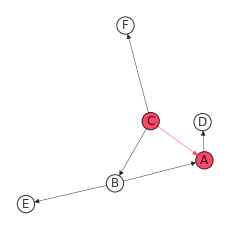

<!-- #region -->
# PIC ([Patent with Indirect Connection](https://doi.org/10.3390/su13020820))
## Installation

`pip install git+https://github.com/lee-ju/PIC.git`

#### [Patents with Indirect Connection](https://doi.org/10.3390/su13020820)

## Usage

```python
import pandas as pd

from_cam = ['A', 'B', 'B', 'C', 'C']
to_cam = ['D', 'A', 'E', 'B', 'F']

from_sam = ['A']
to_sam = ['C']

repo = {'A':2017, 'B':2010, 'C':2005}

pu = pic_utils(from_cam, to_cam, from_sam, to_sam, repo, direct=True)

pic_E, pic_L = pu.explorer(max_date=20)
pic = {'P_E': pic_E, 'P_L': pic_L}
df_pic = pd.DataFrame(pic)

CS_net = pu.cs_net(pic_E, pic_L, fs=[3, 3], with_labels=True,
                   node_size=300, font_size=12, seed=10)
```
```python
[Out]:

100%|██████████| 1/1 [00:00<00:00, 11366.68it/s]
  P_E P_L
0   C   A
```


## Parameters
    
#### `PIC` (see: [PIC](https://doi.org/10.3390/su13020820))

- `pic_utils` constructor:
    1. `from_cam`: In-node lists of Citation Adjacency Matrix.
    2. `to_cam`: Out-node lists of Citation Adjacency Matrix.
    3. `from_sam`: In-node lists of Similarity Adjacency Matrix.
    4. `to_sam`: Out-node lists of Similarity Adjacency Matrix.
    5. `repo`: Dictionary of apps and apps_date.
    6. `direct`: Boolean controlling the DiGraph. (default: True)
    
- `pic_utils.explorer` constructor:
    1. `max_date`: The maximum value of the time difference between the filing of two patents. (default: 20)
    
- `pic_utils.cs_net` constructor:
    1. `pic_E`: Output of pic_utils.explorer (CS-Net  on [PIC](https://doi.org/10.3390/su13020820)).
    2. `fs`: List of figsize=[horizontal_size, vertical_size]. (default: [10, 10])
    3. `with_labels`: Boolean controlling the use of node labels. (default: True)
    4. `node_size`: Size of nodes. (default: 100)
    5. `font_size`: Size of labels. (default: 12)
    6. `seed`: Seed for random visualization. (default: 10)
<!-- #endregion -->
